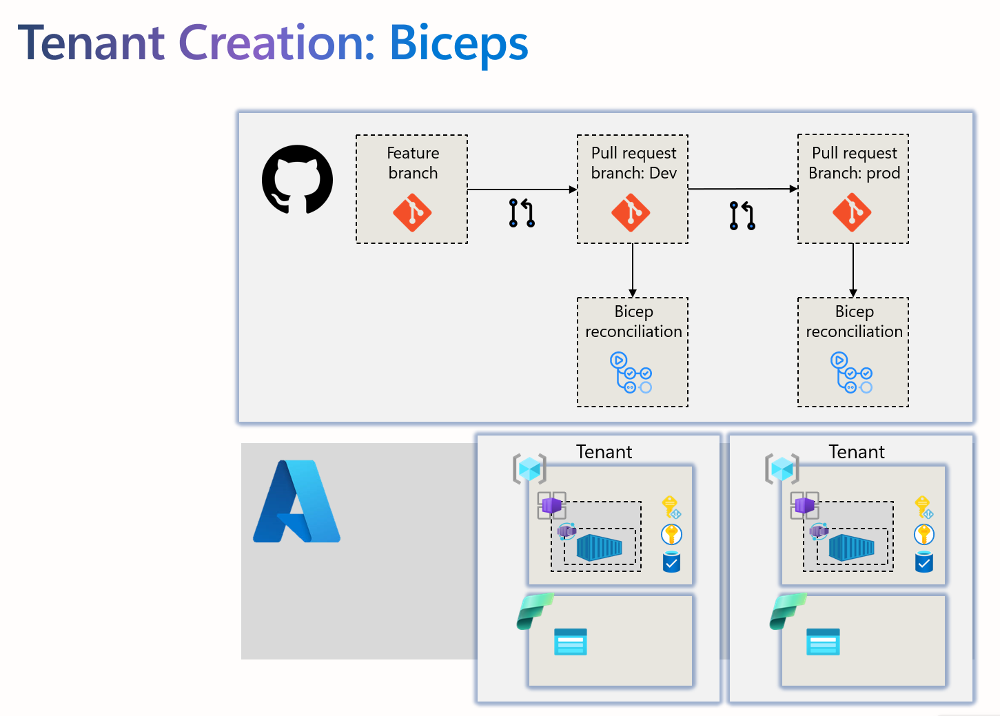

# multitenancy-infra

[](https://github.com/EmeaAppGbb/multitenancy-infra/actions/workflows/ci.yml)


# Prepare 
```bash
cd infra
az bicep upgrade
```

# Run reconciliation locally
```bash
cd infra
az deployment sub create --location westeurope --template-file .\main.bicep --parameters .\main.DEV.bicepparam --what-if  
```

# Architecture
